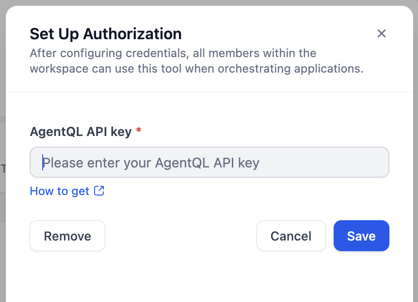
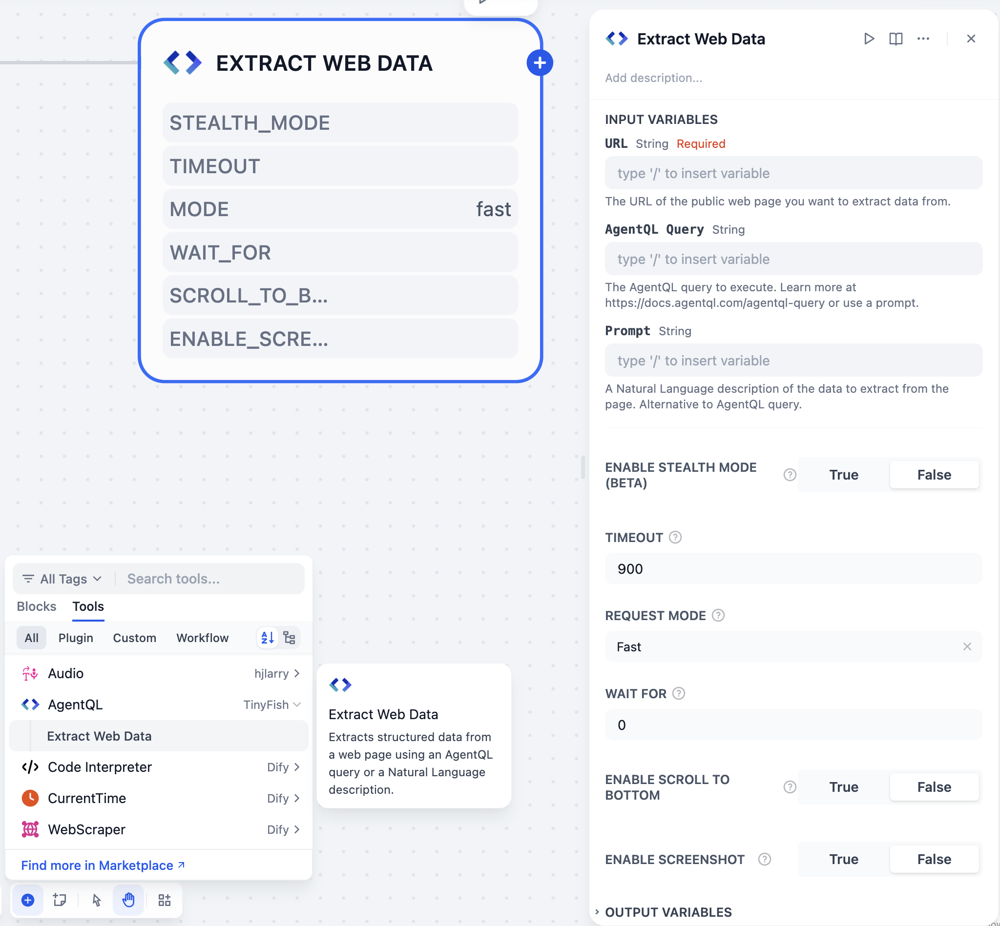
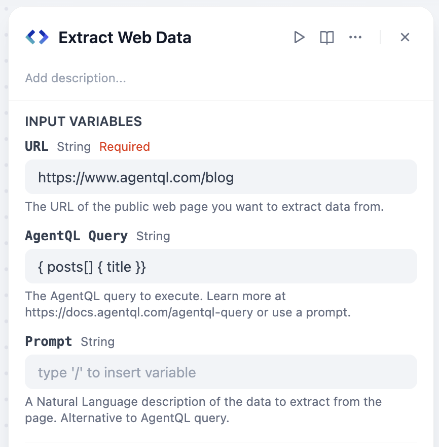
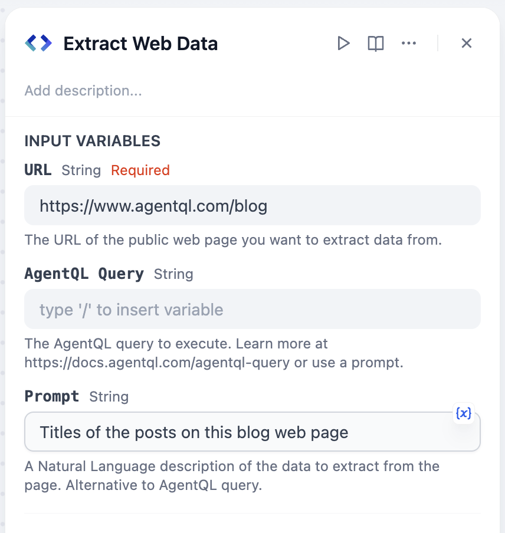
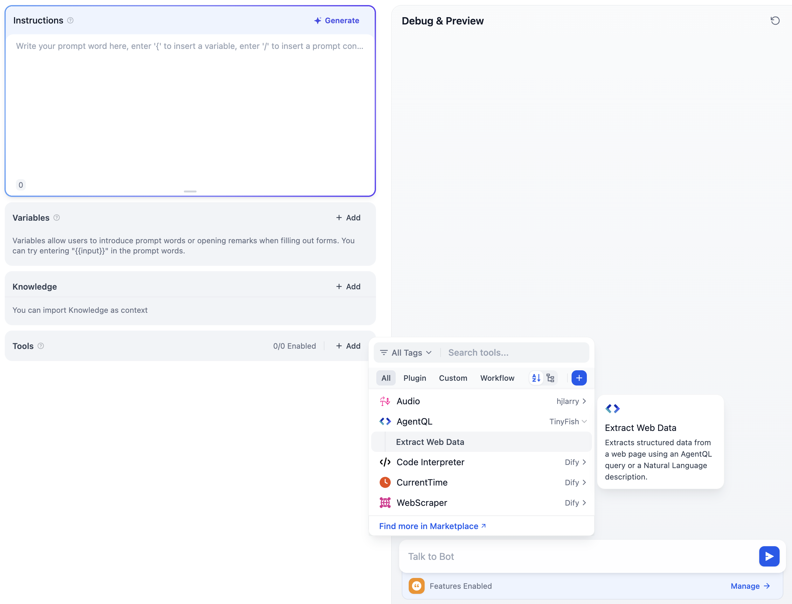
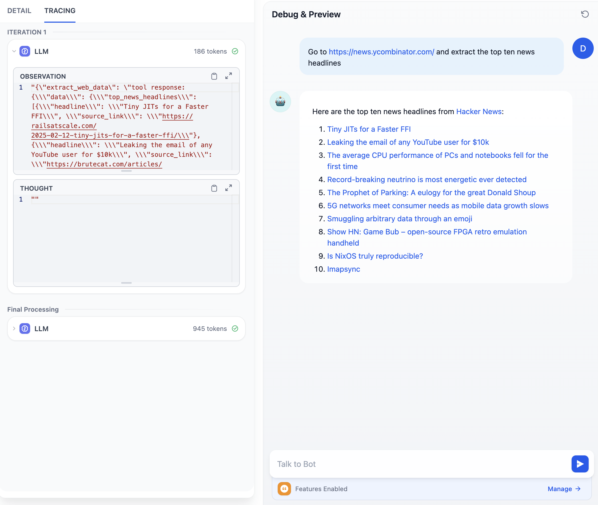
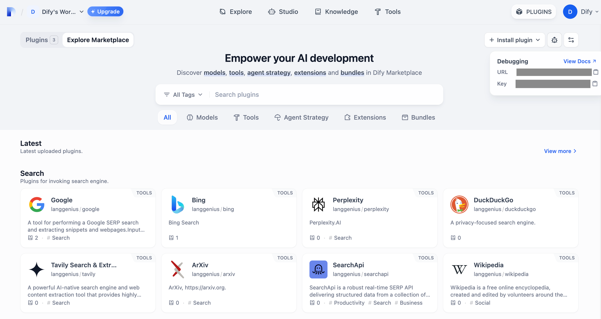
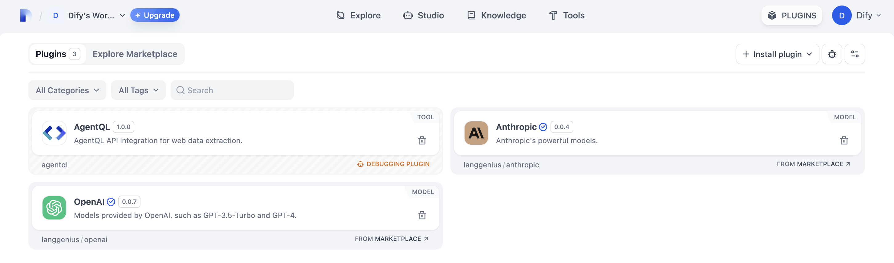

# AgentQL Plugin for Dify

## Overview

**[AgentQL](https://agentql.com)** provides structured data extraction from any web page using an [AgentQL query](https://docs.agentql.com/concepts/query-language) or a Natural Language prompt. AgentQL works across multiple languages and web pages without breaking over time.

## Configuration

### 1. Install AgentQL Tool

1. On the Dify platform, access the [Plugin Marketplace](https://docs.dify.ai/plugins/quick-start/install-plugins#marketplace).
2. Locate and install the AgentQL tool.

### 2. Create an AgentQL API Key

Visit [AgentQL Dev Portal](https://dev.agentql.com/) and generate your API key.

### 3. Authorize AgentQL

Go to **Plugins > AgentQL > To Authorize** in Dify and input your AgentQL API key.



## Workflow Usage

Integrate AgentQL into your pipeline by following these steps:

1. Add AgentQL's **Extract Web Data** tool to your pipeline.
2. Configure input variables in the tool's UI.
3. Run the pipeline to extract web page data.



### Query Methods

AgentQL accepts either an [AgentQL query](https://docs.agentql.com/concepts/query-language) or a Natural Language prompt describing the data you want to extract from a web page.

- Use `query` if you want to extract data in a structure _you_ define.
- Use `prompt` if you want to extract data in a structure _AgentQL_ infers from your Natural Language description.

> **Note:** You must provide either `query` or `prompt`. If both are provided, `query` takes precedence!

Using AgentQL query language:


Using Natural Language:


## Agent Usage

1. Add AgentQL's **Extract Web Data** tool to your Agent app.
2. Prompt the Agent to extract data from a web page with either an AgentQL Query or a Natural Language prompt:
   - To use an AgentQL query, use this prompt: "Extract the data from https://www.agentql.com/blog using the following agentql query: { posts[] { title author }}"
   - To use a Natural Language prompe, use this prompt: "Extract the blog posts title and author from https://www.agentql.com/blog"



**Example:**


## Debugging the Plugin

Dify provides a remote debugging method.

### 1. Get debugging key and server address

On the platform, go to the "Plugin Management" page to get the debugging key and remote server address.



### 2. Add server and key to your environment

Go back to the plugin project, copy the `.env.example` file and rename it to .env. Fill it with the remote server address and debugging key.

The `.env` file:

```bash
INSTALL_METHOD=remote
REMOTE_INSTALL_HOST=debug.dify.ai
REMOTE_INSTALL_PORT=5003
REMOTE_INSTALL_KEY=****-****-****-****-****
```

### 3. Launch the plugin

Run the `python -m main` command to launch the plugin. You can see on the plugin page that the plugin has been installed into Workspace.



## Contributing

We love getting contributions! To get started, here's how to set up the development for AgentQL's Dify Plugin:

### 1. Fork this repository

### 2. Clone the repository

Clone the forked repository from your terminal:

```shell
git clone git@github.com:<github_username>/agentql-integrations.git
```

### 3. Install dependencies with virtual environment (Recommended)

```shell
python -m venv .venv
source .venv/bin/activate
pip install -r requirements.txt
```

### 4. Make your changes and save

### 5. Ensure the plugin works

See the previous [Debugging Guide](#debugging-the-plugin).

### 6. Submit a Pull Request

After confirming that the plugin works properly, submit a pull request to the `main` branch of this repository. If you run into issues like merge conflicts or don't know how to open a pull request, check out [GitHub's pull request tutorial](https://docs.github.com/en/pull-requests/collaborating-with-pull-requests).

## Support

Need help or have a question while using or contributing to the plugin? File a GitHub issue or hop onto our [Discord](https://discord.com/invite/agentql)!
