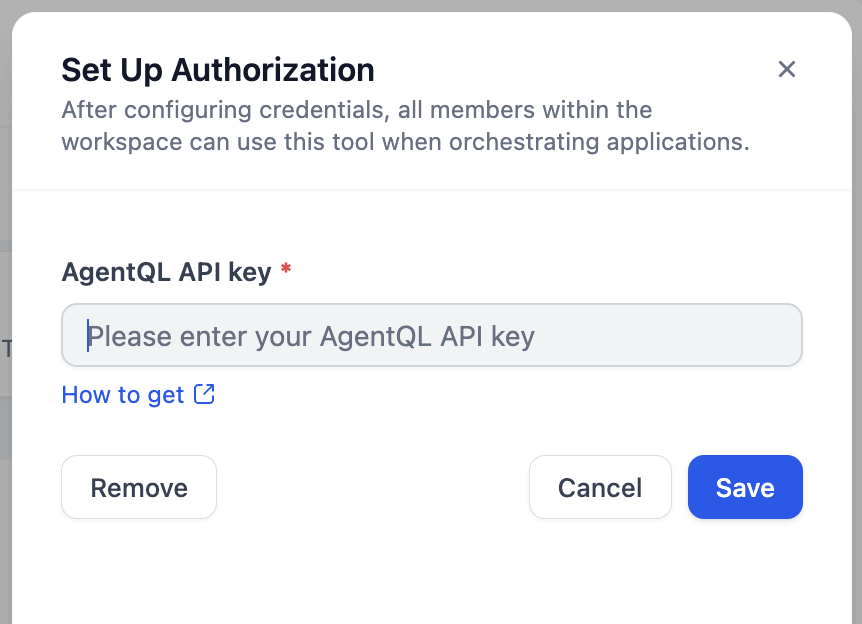
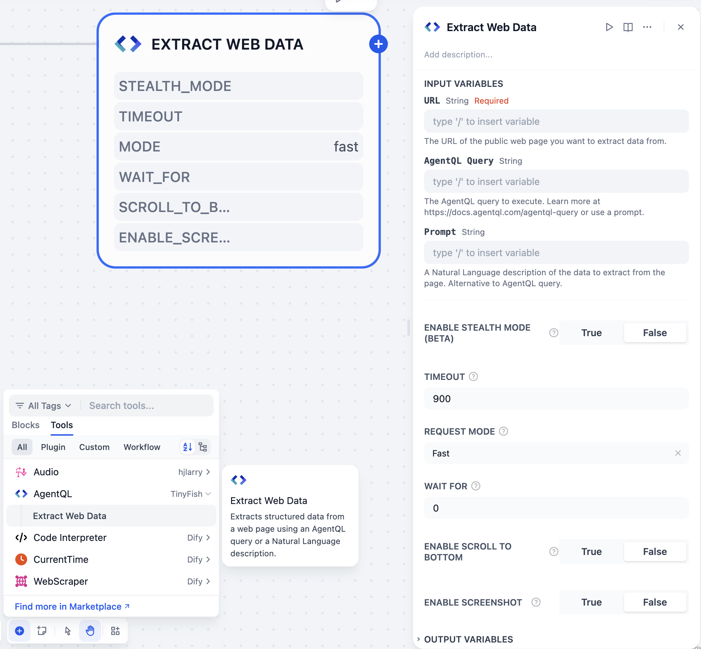
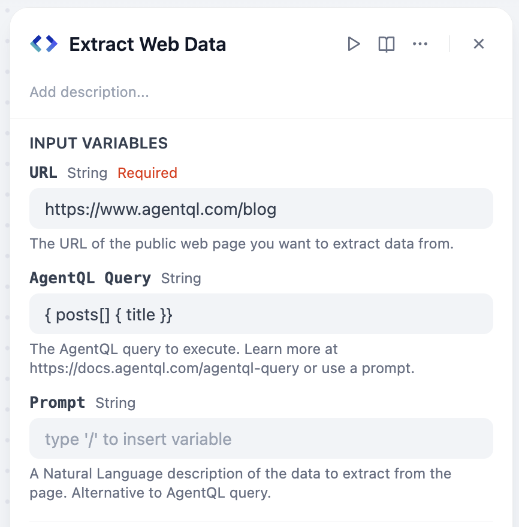
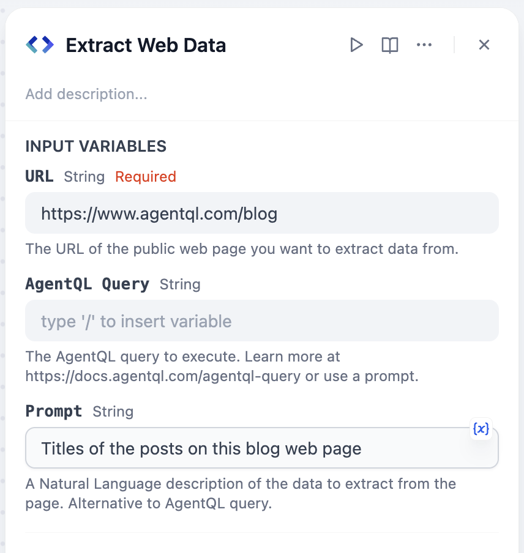
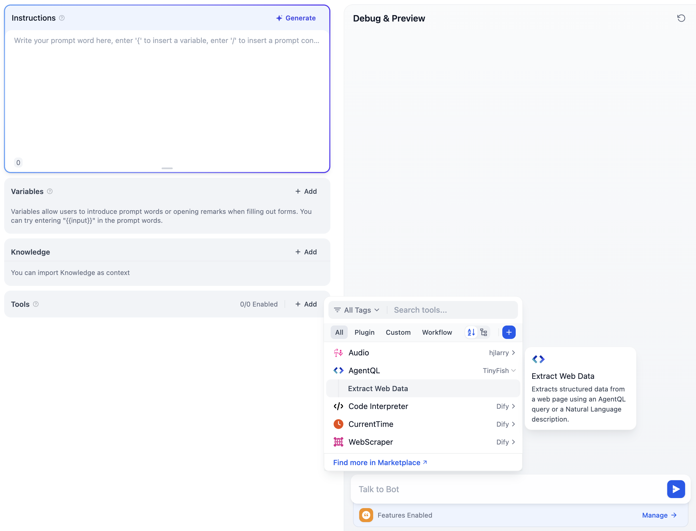
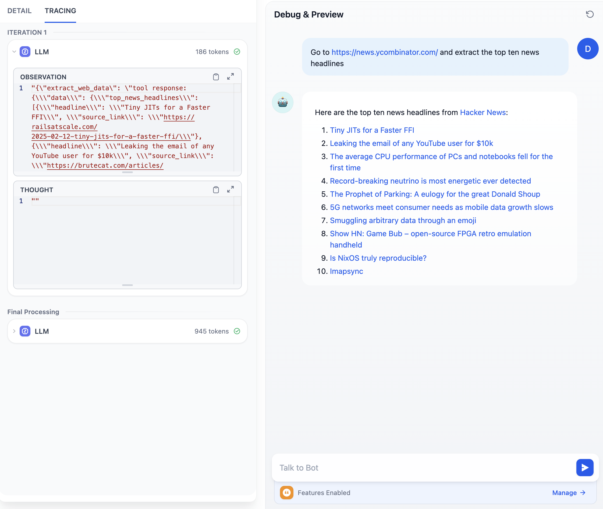

# AgentQL

## Overview

**[AgentQL](https://agentql.com)** provides structured data extraction from any web page using an [AgentQL query](https://docs.agentql.com/concepts/query-language) or a Natural Language prompt. AgentQL works across multiple languages and web pages without breaking over time.

## Configuration

1. **Install AgentQL Tool**

   - Access the Plugin Marketplace
   - Locate and install the AgentQL tool

2. **Create an AgentQL API Key**

   - Visit [AgentQL Dev Portal](https://dev.agentql.com/)
   - Generate your API key

3. **Authorize AgentQL**
   - Go to **Plugins > AgentQL > To Authorize** in Dify
   - Input your API key

## Workflow Usage

Integrate AgentQL into your pipeline by following these steps:

1. Add AgentQL's **Extract Web Data** tool to your pipeline
2. Configure input variables in the tool's UI
3. Run the pipeline to extract web page data

### Query Methods

Using AgentQL query language:

Using Natural Language:

> **Note:** You must provide either `query` or `prompt`. If both are provided, `query` takes precedence:
>
> - Use `query` if you want to extract data in a structure _you_ define.
> - Use `prompt` if you want to extract data in a structure _AgentQL_ infers from your Natural Language description.

## Agent Usage

1. Add AgentQL's **Extract Web Data** tool to your Agent app
2. Prompt the Agent to extract data from a web page with either an AgentQL query or a Natural Language prompt:
   - Using AgentQL query: "Extract the data from https://www.agentql.com/blog using the following agentql query: { posts[] { title author }}"
   - Using Natural Language: "Extract the blog posts title and author from https://www.agentql.com/blog"

**Example:**

